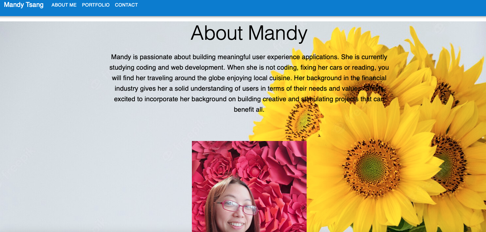

# Mandy Tsang's Portfolio

There is no better place to learn and showcase my programming skills and works than a portfolio website.

## Built With

* [HTML](https://developer.mozilla.org/en-US/docs/Web/HTML)
* [CSS](https://developer.mozilla.org/en-US/docs/Web/CSS)
* [JavaScript](https://developer.mozilla.org/en-US/docs/Web/JavaScript)
* [Node.js](https://nodejs.org/en/)
* [MUI / Material UI](https://mui.com/)

## Deployed Link

- [Link to deployment](https://mandytsang007.github.io/new-portfolio/)
- [Link to Github](https://github.com/MANDYTSANG007/hmtportfolio)

## Design Layout

## Author
**Mandy Tsang**

- [Github](https://github.com/MANDYTSANG007)
- [LinkedIn](https://www.linkedin.com/in/man-tsang-64308b22a/)

## License
This project is licensed under the MIT License